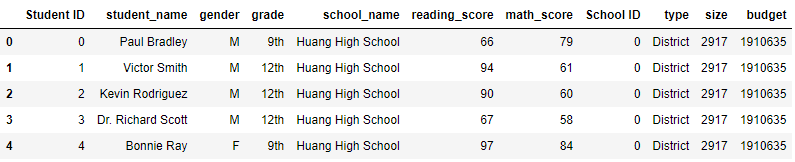
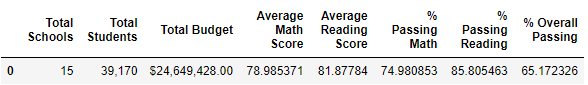
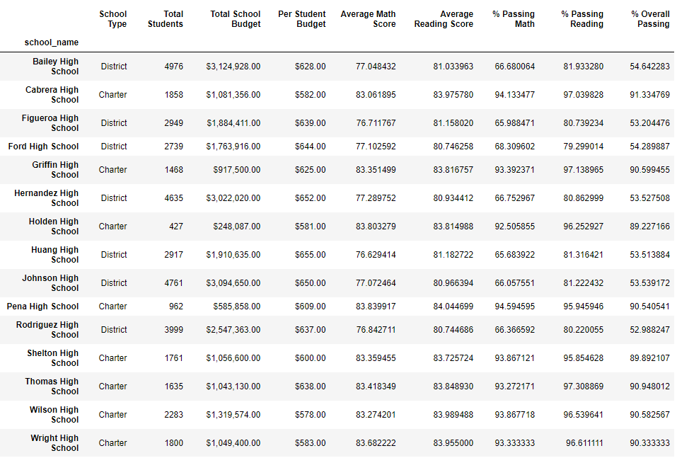
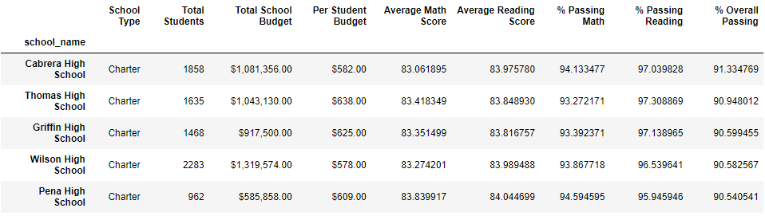
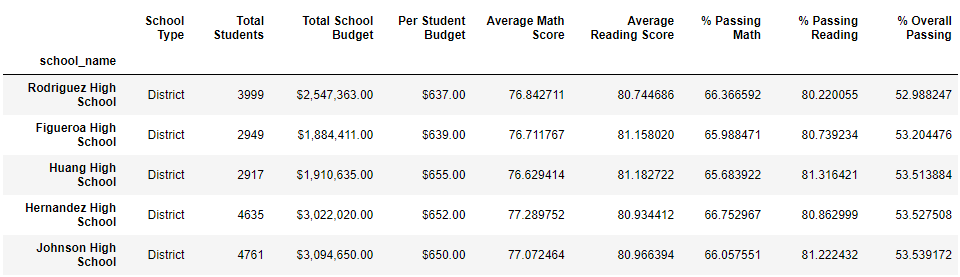
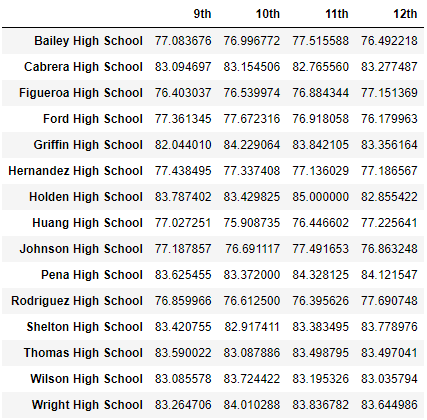
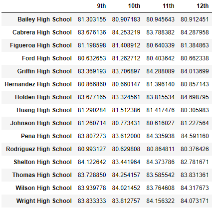
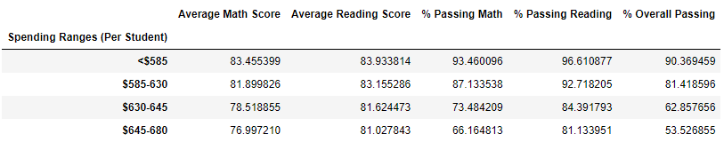
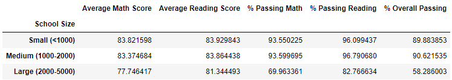
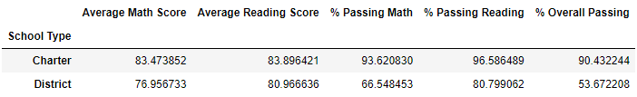

# Module 4: pandas challenge - PyCitySchools

## Table of Contents
* [Background](https://github.com/dspataru/pandas-challenge/blob/main/README.md#background)
* [Observable Trends](https://github.com/dspataru/pandas-challenge/blob/main/README.md#observable-trends)
* [Merged DataFrame](https://github.com/dspataru/pandas-challenge/blob/main/README.md#merged-dataframe)
* [District Summary](https://github.com/dspataru/pandas-challenge/blob/main/README.md#district-summary)
* [School Summary](https://github.com/dspataru/pandas-challenge/blob/main/README.md#school-summary)
* [Top Performing Schools (By % Overall Passing)](https://github.com/dspataru/pandas-challenge/blob/main/README.md#top-performing-schools-by--overall-passing)
* [Bottom Performing Schools (By % Overall Passing)](https://github.com/dspataru/pandas-challenge/blob/main/README.md#bottom-performing-schools-by--overall-passing)
* [Math Scores by Grade](https://github.com/dspataru/pandas-challenge/blob/main/README.md#math-scores-by-grade)
* [Reading Scores by Grade](https://github.com/dspataru/pandas-challenge/blob/main/README.md#reading-scores-by-grade)
* [Scores by School Spending](https://github.com/dspataru/pandas-challenge/blob/main/README.md#scores-by-school-spending)
* [Scores by School Size](https://github.com/dspataru/pandas-challenge/blob/main/README.md#scores-by-school-size)
* [Scores by School Type](https://github.com/dspataru/pandas-challenge/blob/main/README.md#scores-by-school-type)

## Background

This repository contains an analysis of city school district data. The project uses two datasets:
1. [schools_complete.csv](https://github.com/dspataru/pandas-challenge/blob/main/Resources/schools_complete.csv) : contains data pertaining to the schools including School ID, school_name, type, size, and budget.
2. [students_complete.csv](https://github.com/dspataru/pandas-challenge/blob/main/Resources/students_complete.csv) : contains data about students at each school and their Student ID, student_name gender, grade, school_name, reading_score, and math_score.

The above two csv files can be found in the Resources folder of the current repository. Python's pandas library is used to import, merge, and sort the data into dataframes to analyze school and standardized test data to discover trends that might help to make strategic decisions regarding future school planning.

The IDE used for this challenge is Jupyter Notebook.

#### Key Words
Jupyter Notebook, Pandas, Python, DataFrames, DataSets.

## Observable Trends

* The high schools with the highest total number of students such as Bailey High, Hernandez High, Johnson High, and Rodriguez High have the lowest % overall passing scores, while the schools with the lowest student population including Holden High and Pena High have some of the highest % overall passing scores. The School Summary table shows this relationship.
* Based on the top performing schools by % overall passing summary table, the top 5 schools are charter schools. In contrast, the bottom performing schools are all district schools.
* The reading and math scores are fairly consistent across all grades when grouped by schools. Generally, students tend to score higher in reading class than math class.
* Looking at the scores by school spending table, the less spending per student, the higher the overall passing grade.
* Looking at the scores by school type table, the large schools have a significantly lower % overall passing than medium and small school sizes.
* The scores by school type table shows that students that go to district schools have a lower % overall passing than students that go to charter schools.
* Based on the analysis performed on the combined dataset, smaller schools have better student passing rates and this is likely because the teachers can provide more individualized attention to the students. Assuming that the number of classes per grade at each school is the same, this may show that smaller class sizes have a positive impact on a student's ability to learn and perform well. A more throughough analysis would need to be completed to determine whether or not per student spending is relted to a positive or negative correlation of passing % or if it is more to do with the size of the school itself.
* District high schools take on more students which leads to more money per student but lower passing rates. It is also notable that the top performing schools have a smaller difference between the % of students passing math and the % of students passing reading, while the bottom performing schools have a larger difference between the % of students passing math and the % of students passing reading. 

## Merged DataFrame

## District Summary

The district summary provides a high-level snapshot of the district's key metrics in a DataFrame that includes the following:
* Total number of unique schools
* Total students
* Total budget
* Average math score
* Average reading score
* % passing math (the percentage of students who passed math)
* % passing reading (the percentage of students who passed reading) 
* % overall passing (the percentage of students who passed math AND reading)

## School Summary

The school summary is a DataFrame that contains the following key metrics about each school:
* School name
* School type
* Total students
* Total school budget
* Per student budget
* Average math score
* Average reading score
* % passing math (the percentage of students who passed math)
* % passing reading (the percentage of students who passed reading)
* % overall passing (the percentage of students who passed math AND reading)

## Top Performing Schools (By % Overall Passing)

The top_schools DataFrame sorts the schools by % overall passing in descending order and takes the top five schools.

## Bottom Performing Schools (By % Overall Passing)

The bottom_schools DataFrame sorts the schools by % overall passing in ascending order and takes the first five schools (aka the lowest ranked schools).

## Math Scores by Grade

This DataFrame contains the average math scores for students from grades nine to 12 at each school.

## Reading Scores by Grade

This DataFrame contains the average reading scores for students from grades nine to 12 at each school.

## Scores by School Spending

The spending_summary DataFrame breaks down school performance based on the average spending ranges per student. The spending budget is split into four spending bins: <$585, $585-630, $630-645, and $645-680. The average spending amount per student is calculated for each bin. The spending_summary DataFrame includes the following metrics:
* Average math score
* Average reading score
* % passing math (the percentage of students who passed math)
* % passing reading (the percentage of students who passed reading)
* % overall passing (the percentage of students who passed math AND reading)

## Scores by School Size

The size_summary DataFrame breaks down school performance based on the size of the school. The school size is split into three bins: small (<1000 students), medium (1000-2000 students), and large (2000-5000 students). The size_summary DataFrame includes the following metrics:
* Average math score
* Average reading score
* % passing math (the percentage of students who passed math)
* % passing reading (the percentage of students who passed reading)
* % overall passing (the percentage of students who passed math AND reading)

## Scores by School Type

The type_summary DataFrame shows the school performance based on the school type: District or Charter. The type_summary DataFrame includes the following metrics:
* Average math score
* Average reading score
* % passing math (the percentage of students who passed math)
* % passing reading (the percentage of students who passed reading)
* % overall passing (the percentage of students who passed math AND reading)

